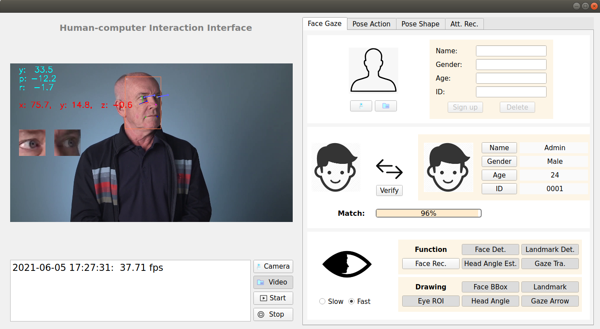
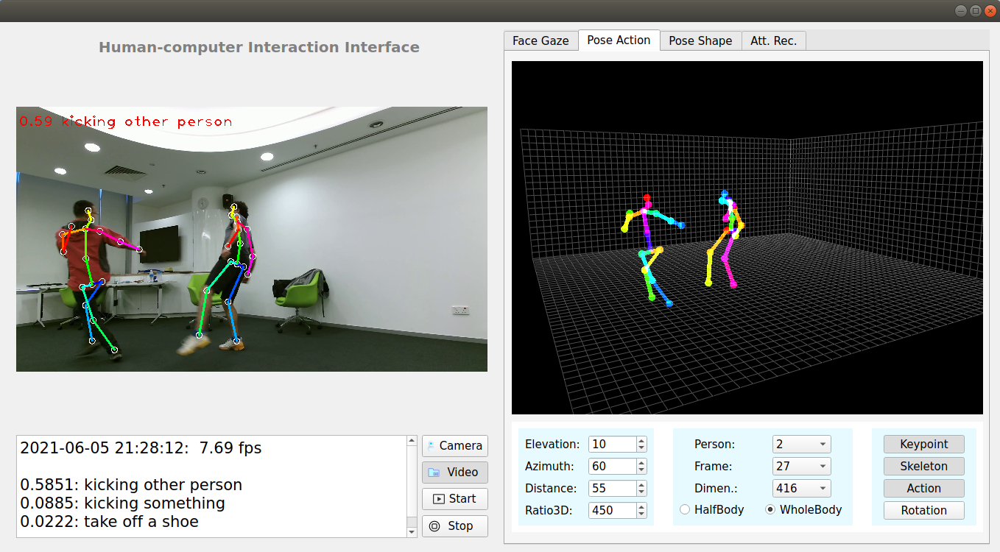

<center><font size=6>人机交互系统</font></center>

### 项目简介

​	    该项目搭建了一个由**人脸&关键点检测**、**人脸识别**、**头部姿态估计**、**人眼视线跟踪**、**行人检测与跟踪**、**2D/3D人体姿态估计**和**行为识别**等算法组成的人机交互系统。该系统已实现了”**数据采集**“、“**人脸识别与视线跟踪**”和”**姿态估计与行为识别**“三大功能模块。其中，数据采集模块作为基础模块存在，结合后续两大模块实现简单的人机交互操作，其界面如图1和图2所示。


- **图像数据采集模块**：

  ​       该模块主要从摄像头或导入视频中采集图像数据，其界面如图1左侧区域所示。

  - **图像数据采集与显示**：Camera/Video $\longrightarrow$ Start（点击"Start"后，”Start“图标变成"Pause"）

  ```
  Camera: 由前置摄像头采集图像数据;
  Video: 从导入视频采集图像数据。
  ```

  

- **人脸识别与视线跟踪模块**：

  ​       该模块集成人脸&关键点检测、人脸识别、头部姿态估计和人眼视线跟踪等算法，主要用于实现人脸识别和人眼视线跟踪功能，其交互界面如图1右侧区域所示，分为上中下功能栏。[[演示效果]](./data/video/Face-Recognition-Gaze-Estiamtion_speed_up.mp4)

  - **人脸识别**：人脸检测(Retinaface) $\longrightarrow $ 人脸关键点检测与对齐 $\longrightarrow$ 人脸特征提取$\longrightarrow$ 人脸匹配

  - **人眼视线跟踪**： 人脸检测 $\longrightarrow$ 人脸关键点检测 $\longrightarrow$ 人眼视线估计 (OpenVINO)

    ​											$\searrow$      头部姿态估计    $\nearrow$ 



<center>图1  人脸识别与视线跟踪交互界面</center>


- **姿态估计与行为识别模块**：

  ​        该模块集成行人检测与跟踪、2D人体姿态估计、3D人体姿态估计和基于人体骨架的行为识别等算法，主要用于实现姿态估计与行为识别功能，其界面如图2右侧区域所示，分为上下功能栏。

  - **2D人体姿态估计**：行人检测 $\longrightarrow$ 行人跟踪$\longrightarrow$ 2D姿态估计
  - **3D人体姿态估计**：行人检测 $\longrightarrow$ 行人跟踪 $\longrightarrow$ 2D姿态估计 $\longrightarrow$ 2D-to-3D重建
  - **行为识别**：行人检测 $\longrightarrow$ 行人跟踪(SORT) $\longrightarrow$ 2D姿态估计 $\longrightarrow$ 2D-to-3D重建 $\longrightarrow$ 行为识别

  ```
  上端界面：实时可视化3D人体姿态估计的效果。
  
  下端界面：界面、算法参数设置，相应功能运行。
      可视化界面参数设置：Elevation、Azimuth、Distance、Ratio3D
      算法参数设置：Person(跟踪人数)、Frame(3D人体姿态估计感受野)、Dimen(行人检测输入图片维度)、HalfBody(半身姿态估计)、WholeBody(全身姿态估计)
      功能运行：Keypoint(2D人体姿态估计)、Skeleton(3D人体姿态估计)、Action(行为识别)、Rotation(可视化界面旋转)
  ```



<center>图2  姿态估计与行为识别交互界面</center>


